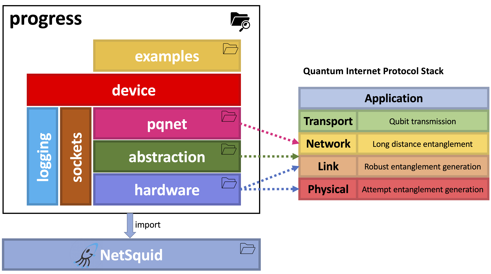

.. ProgReSS documentation master file, created by
   sphinx-quickstart on Mon Apr  3 12:40:04 2023.
   You can adapt this file completely to your liking, but it should at least
   contain the root `toctree` directive.

ProgReSS
====================================

Welcome to the documentation of **P**\rogrammable quantum **R**\epeaters **S**\oftware **S**\imulator (**ProgReSS**),
a Python package for the simulation of programmable quantum networks, built on top of
`NetSquid <https://netsquid.org/>`_.

You can download and install the ProgReSS package `here <https://github.com/LBacciottini/ProgReSS/>`_.

The package is organized as follows:

where
   - The Quantum Internet Protocol Stack in the picture is the one proposed by
     `Dahlberg et al. <https://dl.acm.org/doi/10.1145/3341302.3342070>`_.
   - The **hardware** package contains the classes that model the quantum hardware of the devices
     (e.g. quantum processors, optical fibers, QNICs etc.) and the Link Layer Protocols (LLPs).
     For this reason, it is linked to the **Physical** and **Link** layers of the reference stack.
   - The **abstraction** package contains the Quantum Hardware Abstraction Layer (QHAL) class.
     Its role is to provide a unified interface to the **Network** layer for what concerns quantum
     resources and quantum hardware operations. As such, it can be seen as an adaptation layer
     placed between the **Link** and **Network** layers of the reference stack.
   - The **pqnet** package (**P**\rogrammable **Q**\uantum **NET**\work) is the core of ProgReSS
     It is our implementation of the **Network** layer,
     and it contains a framework to realize a completely programmable quantum network.
   - The **device** module is built on top of the underlying packages and it contains the QNetworkDevice
     class, which models a configurable, programmable quantum network device ready to be installed in
     the user's custom topology.
   - The **examples** package contains some examples of how to use the ProgReSS package to simulate
     and test programmable quantum network topologies.
   - Some utility modules (**logging**, **sockets**) are used across the whole package.

Since ProgReSS simulates a programmable quantum network, we propose a network architectural model
where the data plane of the Network layer (i.e. the operations carried out by quantum repeaters
at this level) is programmed by a centralized **Quantum Network Controller (QNC)**.
In the picture below, we show our model:

.. image:: assets/prog_net.png
    :align: center
    :width: 450px

From top to bottom: Applications (APP) are provided with end-to-end
entanglement without any knowledge about the
underlying infrastructure. This service is obtained
thanks to a set of Virtual Quantum Network Functions (VQNFs),
that are requested to the centralized network controller through the northbound
interface. The controller exploits the southbound
interface to program all the infrastructure devices
at the Network (NET) level to realize the specified
VQNFs.

.. toctree::
   :maxdepth: 2
   :caption: Contents:

   progress/abstraction/abstraction
   progress/device
   progress/hardware/hardware
   progress/logging
   progress/messaging/messaging
   progress/pqnet/pqnet
   progress/sockets

Indices and tables
==================

* :ref:`genindex`
* :ref:`modindex`
* :ref:`search`
