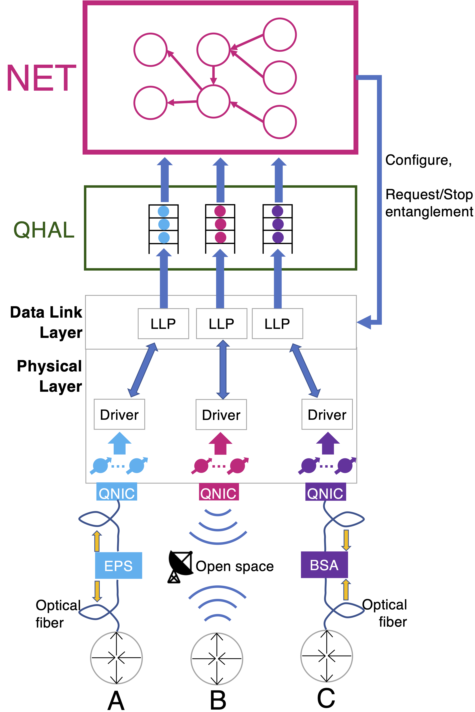

progress.device
===================================
This module contains the quantum network device class.
It is a ready-to-use quantum network device that can be used as a programmable repeater or end node of the network.

We show below the layered architecture of a quantum network device in our architectural model:

The device architecture is composed of the following layers (bottom-up):

    - Physical layer: The quantum hardware (quantum memory, processor, QNICs, etc.)
    - Link Layer Protocols: The classical control protocols to generate robust entanglement over each QNIC.
    - Quantum Hardware Abstraction Layer: The QHAL (see :class:`~progress.abstraction.qhal.QHAL`). It abstracts the
      quantum hardware resources and provides a unified interface for the NET layer.
    - NET layer: The NET layer is responsible for processing link-generated entanglement and delivering long-range
      entanglement to the applications. We implemented the NET layer as a programmable framework called PQ-NET
      (see :class:`~progress.pqnet.__init__`).

We point out that from the Link Layer up, all the processing and the information exchange is done via classical
communication. The Physical layer is the only layer that is responsible for quantum computation.
The NET layer can request quantum operations to the Physical layer through the API exposed by the QHAL.

.. automodule:: progress.device
   :members:
   :show-inheritance:
